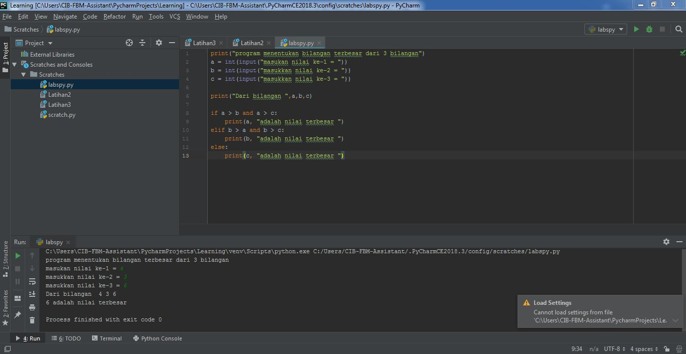

# labspy02
# Algoritma menentukanbilangan terbesar dari 3 bilangan

* Mulai
* Inisiasi bil1,bil2,bil3 sebagai integer.
* Baca bil1.
* Baca bil2.
* Baca bil3.
* Jika bil1 > bil2 dan bil1 > bil3 maka kerjakan langkah 8, selain itu
* Jika bil2 > bil1 dan bil2 > bil3 maka kerjakan langkah 9, selain itu kerjakan langkah 10.
* Cetak “Bilangan Terbesar Bilangan Pertama”.
* Cetak “Bilangan Terbesar Bilangan Kedua”.
* Cetak “Bilangan Terbesar Bilangan Ketiga”.
* Selesai

# Flowchart menentukan bilangan terbesar dari 3 bilangan
#  <h2>

# Hasil Program dan eksekusi
Program setelah dibuat dari algoritma di atas
#  <h2>

Penjelasan program
inisialisasi dan input
#  <h2>

Percabangan
#  <h2>

Hasil eksekusi Program
#  <h2>

